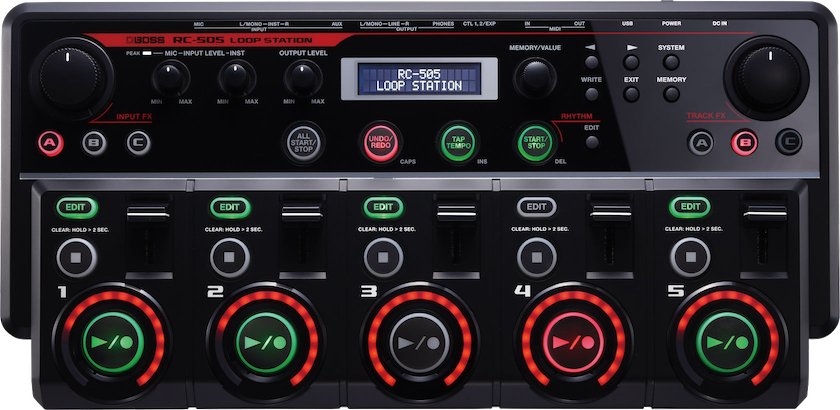

# Boss RC-505 (mk1) cheatsheet

 

### Welcome to the Boss RC-505 (mk1) cheat sheet

| scope  | task                         | buttons                                                                                                     |
|--------|------------------------------|-------------------------------------------------------------------------------------------------------------|
| track  | Create Blank Loop            | press the ⏹︎ stop button + press the ▶️ / ⏺︎ button                                                         |
| track  | Clearing Track Quickly       | double-press the ⏹︎ stop button                                                                             |
| track  | Clear Track                  | hold down the ⏹︎ stop button for two seconds                                                                |
| track  | Undo track                   | press the undo/redo button + press ▶️ / ⏺︎ track button to undo, only green blinking tracks can be undo-ed  |
| track  | Redo track                   | press the undo/redo button +  press ▶️ / ⏺︎ track button to undo, only red blinking tracks can be redo-ed   |
| track  | Enable/Disable Track Effects | press the edit button to enable or disable the track effects. Works only track effects are selected         |
| global | Clear All Tracks             | long-press the ALL START/STOP button                                                                        |
| global | Reset tempo to original      | long-press the tap tempo knop to reset tempo to the original tempo of the project/track?               |

## 
⏸︎ pause
⏹︎ stop
⏺︎ record
▶ play

## Resources
- https://static.roland.com/assets/media/pdf/RC-505_e02_W.pdf
- https://rc50looper.jimdofree.com/rc-505/
- https://www.youtube.com/@BenRowlandsMusic
- https://www.youtube.com/@DFTBAndy
- https://www.youtube.com/playlist?list=PLuoApSwcjod-7T8RFhY0__9zPp338XApC
- https://www.youtube.com/@GazWilliams
